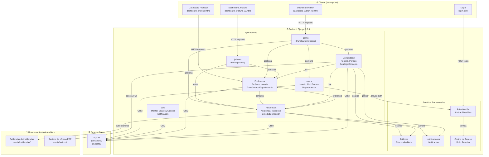
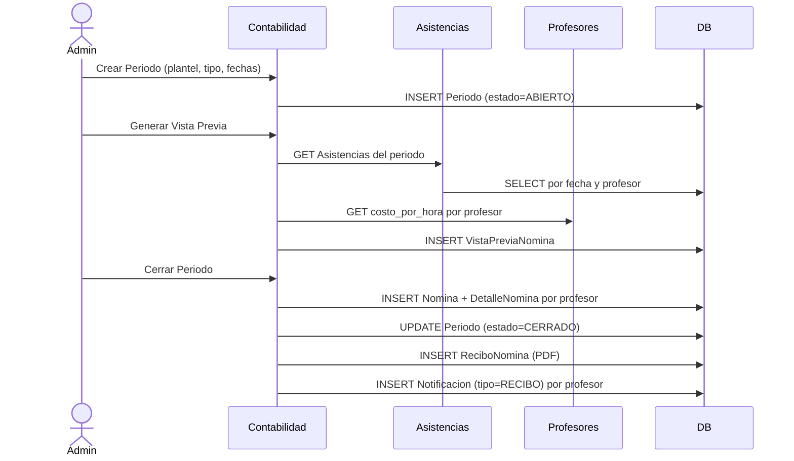

# STX-CORE-ARC-COMPONENTES-v1.0
# Diagrama de Componentes / Arquitectura — Saltix

**Proyecto:** Saltix  
**Versión:** 1.0  
**Fecha:** 2026-03-13  

---

## Vista General del Sistema

---

## Descripción de los Módulos

| Módulo | Responsabilidad principal | Depende de |
|---|---|---|
| `users` | Autenticación, roles, permisos, departamentos | `core` (Plantel) |
| `core` | Planteles, bitácora de auditoría, notificaciones | — |
| `Profesores` | Alta/baja de profesores, horarios, transferencias | `users`, `core` |
| `Asistencias` | Registro de asistencia, incidencias, correcciones | `Profesores`, `users`, `core` |
| `Contabilidad` | Nómina, periodos, conceptos fiscales, recibos | `Profesores`, `Asistencias`, `core` |
| `admin` | Vistas y lógica del panel administrador | todos los módulos |
| `jefatura` | Vistas y lógica del panel de jefatura | `Profesores`, `Asistencias` |

---

## Flujo Principal: Cálculo de Nómina

