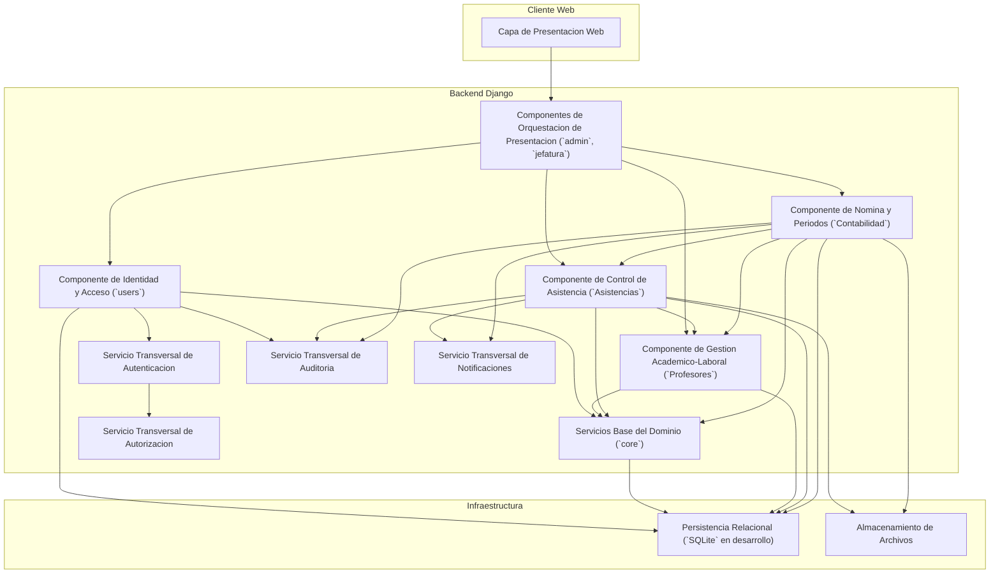
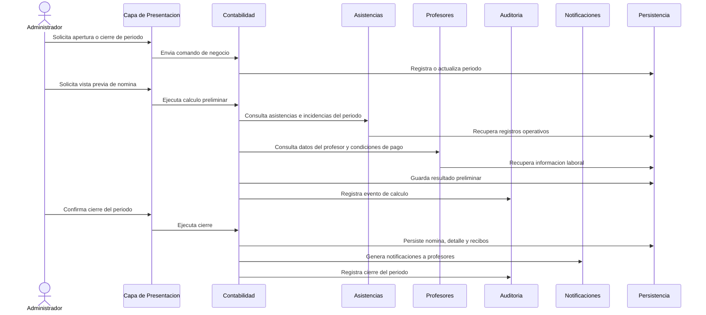

# STX-CORE-ARC-COMPONENTES-v1.0
# Arquitectura de Componentes del Sistema Saltix

**Proyecto:** Saltix  
**Sistema:** Control de Asistencia y Calculo de Nomina  
**Version:** 1.0  
**Fecha:** 2026-03-13  
**Estado:** Baseline arquitectonica

---

## 1. Proposito del Documento

Este documento define la arquitectura de componentes de Saltix con un criterio estricto de ingenieria de software. Su objetivo no es listar cualquier modulo o archivo del proyecto, sino identificar unicamente aquellas unidades arquitectonicas que:

- encapsulan una responsabilidad funcional o tecnica claramente delimitada;
- exponen puntos de colaboracion reconocibles hacia otros elementos del sistema;
- pueden evolucionar, refactorizarse o sustituirse con impacto controlado;
- poseen cohesion interna suficiente para ser tratadas como unidades de diseno, implementacion y mantenimiento.

En consecuencia, este documento distingue entre:

- **componentes arquitectonicos mayores**, que representan unidades principales del sistema;
- **servicios transversales**, que proveen capacidades compartidas a varios componentes;
- **elementos de infraestructura**, que soportan la operacion del sistema pero no constituyen por si mismos un dominio funcional de negocio;
- **artefactos de interfaz**, tales como vistas HTML especificas, que no se consideran componentes mayores aunque formen parte del sistema.

---

## 2. Criterio Estricto para Identificar un Componente

Para efectos de Saltix, un elemento solo se reconoce como componente si satisface simultaneamente los siguientes criterios:

| Criterio | Descripcion |
|---|---|
| Responsabilidad definida | El elemento atiende un problema concreto del negocio o de la plataforma, sin mezclar de forma arbitraria responsabilidades ajenas. |
| Cohesion interna | Sus clases, modelos, reglas y flujos colaboran para un mismo objetivo arquitectonico. |
| Frontera explicita | Puede identificarse con claridad que datos administra, que operaciones ofrece y que dependencias consume. |
| Bajo acoplamiento relativo | Interactua con otros elementos mediante contratos, modelos o flujos definidos, minimizando conocimiento innecesario de detalles internos. |
| Reemplazabilidad razonable | Puede modificarse o sustituirse por otra implementacion equivalente con impacto acotado, siempre que se preserven sus interfaces y contratos. |
| Relevancia de arquitectura | Su existencia afecta decisiones de diseno, integracion, mantenimiento, pruebas o evolucion del sistema. |

### 2.1 Regla de exclusion

No se consideran componentes mayores:

- una plantilla HTML individual;
- una entidad aislada del modelo de datos;
- una utilidad pequena sin frontera funcional propia;
- un archivo de configuracion individual;
- una dependencia puntual cuya responsabilidad no esta encapsulada como unidad del sistema.

---

## 3. Vista General de Arquitectura

Saltix adopta una arquitectura web por capas apoyada en Django. En terminos de componentes, el sistema puede entenderse como:

1. una capa de presentacion web;
2. un conjunto de componentes de negocio y aplicacion en backend;
3. un conjunto de servicios transversales compartidos;
4. una capa de persistencia e infraestructura.

La estructura actual del repositorio sugiere varios modulos Django. Sin embargo, desde el punto de vista arquitectonico no todos tienen el mismo peso. Algunos representan componentes de negocio claramente reemplazables; otros son capas de orquestacion o soporte.

---

## 4. Diagrama de Componentes

---

## 5. Clasificacion Arquitectonica

La siguiente tabla separa de manera intencional los elementos del sistema segun su naturaleza arquitectonica.

| Elemento | Clasificacion | Se considera componente mayor | Justificacion resumida |
|---|---|---|---|
| Capa de presentacion web | Componente arquitectonico | Si | Encapsula la interaccion usuario-sistema y puede sustituirse por otra interfaz manteniendo contratos HTTP y de sesion. |
| `users` | Componente de negocio/plataforma | Si | Centraliza identidad, usuarios, roles, permisos y estructura organizacional. |
| `Profesores` | Componente de negocio | Si | Encapsula el dominio academico-laboral de los profesores. |
| `Asistencias` | Componente de negocio | Si | Resuelve el control operativo de asistencia, incidencias y correcciones. |
| `Contabilidad` | Componente de negocio | Si | Encapsula la logica de nomina, periodos y recibos. |
| `core` | Componente de servicios base del dominio | Si, con alcance compartido | Provee capacidades y entidades fundacionales reutilizadas por varios componentes. |
| `admin` | Componente de orquestacion/presentacion | No como componente de negocio autonomo | Su funcion principal es exponer vistas y coordinar otros componentes, no resolver un dominio propio. |
| `jefatura` | Componente de orquestacion/presentacion | No como componente de negocio autonomo | Orquesta consultas y revisiones sobre componentes de negocio existentes. |
| Autenticacion | Servicio transversal | No como componente mayor independiente | Es una capacidad transversal del backend, no un dominio separado del negocio. |
| Autorizacion / permisos | Servicio transversal | No como componente mayor independiente | Controla acceso sobre todos los demas componentes. |
| Auditoria | Servicio transversal | No como componente mayor independiente | Presta trazabilidad compartida y no constituye un modulo de negocio autonomo. |
| Notificaciones | Servicio transversal | No como componente mayor independiente | Ofrece una capacidad comun invocada por otros componentes. |
| `SQLite` | Infraestructura | No | Es un mecanismo de persistencia reemplazable, no un componente de negocio. |
| `media/incidencias`, `media/recibos` | Infraestructura | No | Son recursos de almacenamiento, no unidades de responsabilidad funcional independiente. |

---

## 6. Componentes Arquitectonicos Mayores

Esta seccion describe los componentes que, bajo un criterio estricto, si deben tratarse como componentes de arquitectura del sistema.

### 6.1 Capa de Presentacion Web

**Problema que resuelve:**  
Proveer un punto de interaccion utilizable para administradores, jefaturas y profesores, permitiendo ejecutar procesos del sistema de forma controlada.

**Responsabilidad principal:**  
Recibir acciones del usuario, mostrar informacion procesada por el backend, aplicar reglas de navegacion y separar la experiencia de uso de la logica de negocio interna.

**Frontera del componente:**  
Incluye formularios, dashboards, vistas renderizadas y mecanismos de intercambio HTTP con el backend. No debe contener logica central de nomina, asistencias o autorizacion profunda.

**Interfaces y colaboraciones principales:**  

- formularios de autenticacion;
- solicitudes HTTP hacia vistas del backend;
- presentacion diferenciada por rol.

**Justificacion como componente:**  
Se considera componente porque posee responsabilidad propia, frontera clara de interaccion y reemplazabilidad razonable. Puede migrarse a otra tecnologia de interfaz o redisenarse sin obligar a reescribir los componentes nucleares del negocio, siempre que preserve contratos de entrada y salida.

**Criterio de reemplazabilidad:**  
Una implementacion SPA, una interfaz movil o una nueva capa web podrian sustituir esta capa si mantienen la semantica de autenticacion, sesion y operaciones expuestas por el backend.

### 6.2 Componente de Identidad y Acceso (`users`)

**Problema que resuelve:**  
Gestionar de manera consistente quien puede entrar al sistema, bajo que identidad opera y que permisos estructurales posee.

**Responsabilidad principal:**  
Administrar usuarios, roles, permisos, departamentos y asociaciones necesarias para el control de acceso institucional.

**Activos que controla:**  

- entidades de usuario;
- roles y permisos;
- relaciones organizacionales basicas;
- informacion necesaria para autenticacion y autorizacion.

**Dependencias relevantes:**  
Consume servicios base del dominio como planteles y colabora con los servicios de autenticacion y autorizacion.

**Interfaces y colaboraciones principales:**  

- alta, baja y consulta de usuarios;
- asignacion de roles y permisos;
- resolucion de identidad para el resto de componentes.

**Justificacion como componente:**  
Cumple cohesion funcional, frontera definida y relevancia arquitectonica alta. Ademas, es razonablemente reemplazable por otra implementacion de gestion de identidad institucional, siempre que mantenga contratos de usuario, rol y permiso consumidos por los demas componentes.

**Riesgo si se degrada o se mezcla con otros dominios:**  
El sistema perderia trazabilidad de acceso, segregacion de funciones y consistencia de autorizacion.

### 6.3 Componente de Gestion Academico-Laboral (`Profesores`)

**Problema que resuelve:**  
Centralizar el dominio asociado a profesores, su adscripcion organizacional, horarios y movimientos internos.

**Responsabilidad principal:**  
Administrar la informacion operativa necesaria para identificar al profesor como sujeto de asistencia y nomina.

**Activos que controla:**  

- registro de profesores;
- horarios;
- transferencias de departamento;
- atributos laborales requeridos por otros procesos.

**Dependencias relevantes:**  
Depende de identidad organizacional y entidades base del dominio.

**Interfaces y colaboraciones principales:**  

- consulta de informacion del profesor;
- suministro de datos de horario y adscripcion;
- insumo para asistencia y nomina.

**Justificacion como componente:**  
Es un componente porque encapsula un subdominio claro y estable. Su reemplazo por otro modulo de gestion de personal docente es viable mientras preserve los contratos que usan asistencias y contabilidad.

**Criterio de reemplazabilidad:**  
Podria integrarse en el futuro con un modulo institucional de recursos humanos o control escolar sin redisenar la logica completa de asistencias y nomina, siempre que mantenga las interfaces de consulta pertinentes.

### 6.4 Componente de Control de Asistencia (`Asistencias`)

**Problema que resuelve:**  
Registrar y validar la presencia laboral, incidencias operativas y solicitudes de correccion que impactan procesos posteriores.

**Responsabilidad principal:**  
Gestionar el ciclo de vida de la asistencia: captura, validacion, incidencia, evidencia y correccion.

**Activos que controla:**  

- registros de asistencia;
- incidencias;
- solicitudes de correccion;
- evidencias asociadas.

**Dependencias relevantes:**  
Depende de profesores, identidad y servicios base para contextualizar plantel, usuario responsable y periodos operativos.

**Interfaces y colaboraciones principales:**  

- captura y consulta de asistencia;
- revision de incidencias;
- entrega de informacion a contabilidad;
- uso de almacenamiento de archivos para evidencias.

**Justificacion como componente:**  
Es un componente mayor porque resuelve un proceso de negocio completo, con reglas y datos propios, y porque su salida alimenta decisiones criticas de nomina. Posee una frontera clara y puede evolucionar por separado.

**Criterio de reemplazabilidad:**  
Podria reemplazarse por una integracion con reloj checador, biometria o un servicio externo de asistencia, siempre que entregue el mismo contrato funcional hacia nomina y auditoria.

### 6.5 Componente de Nomina y Periodos (`Contabilidad`)

**Problema que resuelve:**  
Transformar datos operativos en resultados economicos verificables, calculando pagos, periodos y recibos.

**Responsabilidad principal:**  
Administrar periodos de nomina, conceptos aplicables, calculos, cierres y generacion de comprobantes.

**Activos que controla:**  

- periodos;
- nominas;
- detalles de nomina;
- catalogos de conceptos;
- recibos y resultados del calculo.

**Dependencias relevantes:**  
Depende de asistencia para insumos operativos, de profesores para atributos de pago y de servicios base para contexto institucional.

**Interfaces y colaboraciones principales:**  

- apertura y cierre de periodos;
- generacion de vistas previas;
- calculo de nomina;
- emision de recibos y notificaciones.

**Justificacion como componente:**  
Es un componente mayor por su alta cohesion, criticidad de negocio y capacidad de evolucion independiente. La logica de nomina no debe quedar distribuida en vistas, modelos dispersos o scripts ad hoc.

**Criterio de reemplazabilidad:**  
Puede sustituirse por una implementacion distinta del motor de calculo o incluso por una integracion con un sistema contable externo, siempre que preserve entradas, salidas, reglas de cierre y trazabilidad de resultados.

### 6.6 Servicios Base del Dominio (`core`)

**Problema que resuelve:**  
Evitar duplicacion de entidades y servicios comunes que son compartidos por multiples componentes.

**Responsabilidad principal:**  
Concentrar capacidades fundacionales del sistema que no pertenecen en exclusiva a un solo dominio de negocio, como planteles, notificaciones base y auditoria comun.

**Activos que controla:**  

- catalogo de planteles;
- estructuras transversales de auditoria;
- estructuras base de notificacion.

**Dependencias relevantes:**  
Es consumido por varios componentes mayores, por lo que debe mantenerse estable y de alta cohesion.

**Justificacion como componente:**  
Se clasifica como componente compartido porque tiene frontera tecnica y funcional reconocible, es reutilizable por varios modulos y puede refactorizarse o dividirse en servicios especializados manteniendo contratos internos.

**Advertencia arquitectonica:**  
`core` debe evitar convertirse en un contenedor generico de "todo lo comun". Si absorbe responsabilidades heterogeneas sin criterio, deja de ser un componente cohesivo y pasa a ser deuda arquitectonica.

---

## 7. Elementos que No Deben Tratarse como Componentes Mayores

### 7.1 `admin`

`admin` no debe clasificarse como componente mayor de negocio porque su responsabilidad principal es orquestar operaciones y exponer funciones administrativas sobre otros componentes. Su reemplazo natural seria otra capa de presentacion o coordinacion, no un subsistema de negocio independiente.

### 7.2 `jefatura`

`jefatura` tampoco constituye un componente mayor autonomo. Representa una proyeccion de interfaz y flujo para un rol especifico del usuario, apoyandose en los dominios ya existentes de profesores y asistencias.

### 7.3 Plantillas HTML especificas

Archivos como `login.html`, `dashboard_admin_v2.html`, `dashboard_jefatura_v2.html` y `dashboard_profesor.html` son artefactos de interfaz dentro de la capa de presentacion. Son importantes, pero individualmente no satisfacen el criterio de componente arquitectonico.

### 7.4 Servicios transversales aislados

Autenticacion, autorizacion, auditoria y notificaciones son capacidades de soporte transversales. Deben documentarse como servicios compartidos, no como dominios mayores equivalentes a nomina o asistencias.

### 7.5 Infraestructura de persistencia

`SQLite`, asi como las carpetas `media/incidencias/` y `media/recibos/`, son decisiones de infraestructura. Son reemplazables y criticas para la operacion, pero no representan componentes funcionales de la arquitectura de negocio.

---

## 8. Servicios Transversales

Los siguientes servicios cruzan varios componentes y deben tratarse como capacidades compartidas:

| Servicio | Funcion | Por que no se modela como componente mayor |
|---|---|---|
| Autenticacion | Validar credenciales e identidad de usuario. | Sirve a todo el backend y no representa un dominio funcional separado del negocio principal. |
| Autorizacion | Determinar permisos y restricciones por rol. | Actua como politica transversal sobre otros componentes. |
| Auditoria | Registrar eventos relevantes para trazabilidad y control. | Su naturaleza es de soporte transversal, no de dominio principal. |
| Notificaciones | Comunicar eventos significativos a los actores del sistema. | Es una capacidad comun invocada por procesos de negocio, no un fin de negocio autonomo. |

---

## 9. Infraestructura Relevante para la Arquitectura

| Elemento | Rol arquitectonico | Observacion |
|---|---|---|
| `SQLite` | Persistencia relacional en desarrollo | Debe asumirse como tecnologia sustituible por otro motor relacional sin alterar la semantica de los componentes. |
| `media/incidencias/` | Almacenamiento de evidencias | Soporta el componente de asistencias, pero no define un dominio propio. |
| `media/recibos/` | Almacenamiento de recibos PDF | Soporta el componente de nomina, pero no constituye por si mismo una unidad funcional. |

---

## 10. Relaciones y Dependencias Principales

La dependencia entre componentes debe interpretarse bajo el principio de direccion funcional de la informacion:

- la capa de presentacion invoca a los componentes de backend, pero no debe contener logica de negocio sustantiva;
- `users` provee identidad y estructura de acceso al resto del sistema;
- `Profesores` provee informacion laboral y de adscripcion a `Asistencias` y `Contabilidad`;
- `Asistencias` provee evidencia operativa a `Contabilidad`;
- `Contabilidad` depende de la calidad y consistencia de los datos provenientes de `Asistencias` y `Profesores`;
- `core` provee elementos base compartidos;
- los servicios transversales son consumidos por varios componentes sin convertirse en su dominio dominante.

Esta disposicion reduce acoplamiento indebido y permite evolucionar cada componente con impacto acotado.

---

## 11. Flujo Arquitectonico Principal: Calculo de Nomina

---

## 12. Conclusiones Arquitectonicas

Desde una perspectiva estricta, Saltix no debe describirse como una coleccion indiferenciada de apps Django. Debe entenderse como un sistema compuesto por un numero reducido de componentes con fronteras reconocibles:

- capa de presentacion web;
- identidad y acceso;
- gestion academico-laboral de profesores;
- control de asistencia;
- nomina y periodos;
- servicios base del dominio.

El resto de elementos debe documentarse segun su verdadera naturaleza: orquestacion, servicio transversal o infraestructura. Esta distincion mejora la calidad del diseno, facilita revisiones tecnicas serias y reduce ambiguedad en decisiones futuras de mantenimiento, pruebas, integracion o reemplazo tecnologico.

---

## 13. Nota de Evolucion - Sprint 3

Durante Sprint 3 se mantiene la misma frontera arquitectonica definida en este documento:

- `Asistencias` concentra la logica nueva de consulta, resolucion y correccion.
- `jefatura` continua como capa de orquestacion y presentacion para el rol de jefatura.
- `Profesores` solo se extiende para mostrar el estado de incidencias ya creadas.

No se introduce un nuevo componente mayor ni se redefine el mapa de dependencias del sistema.
