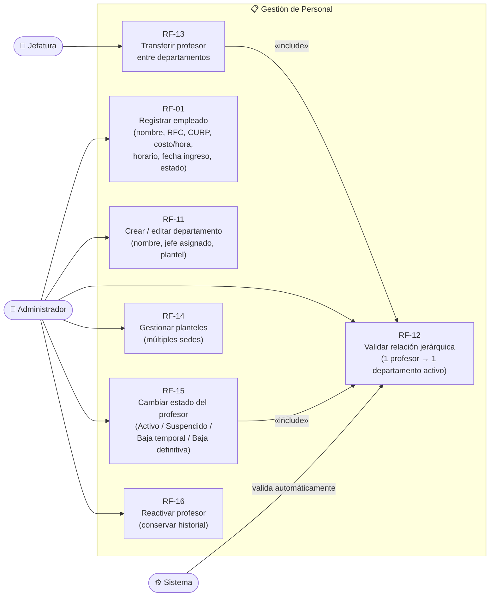
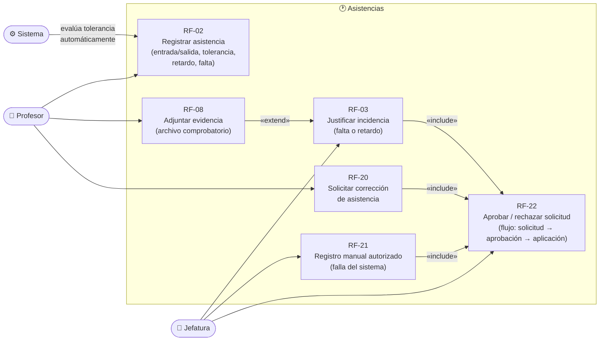
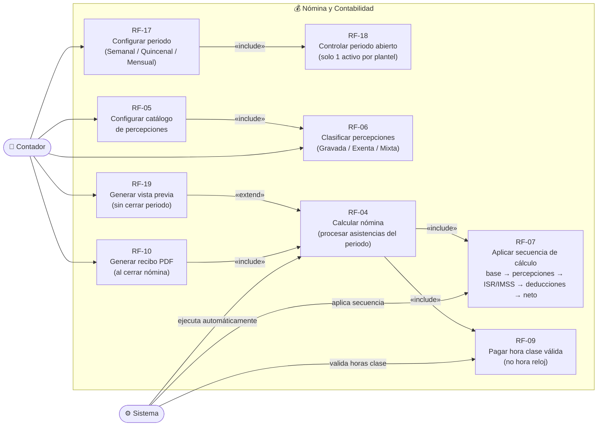
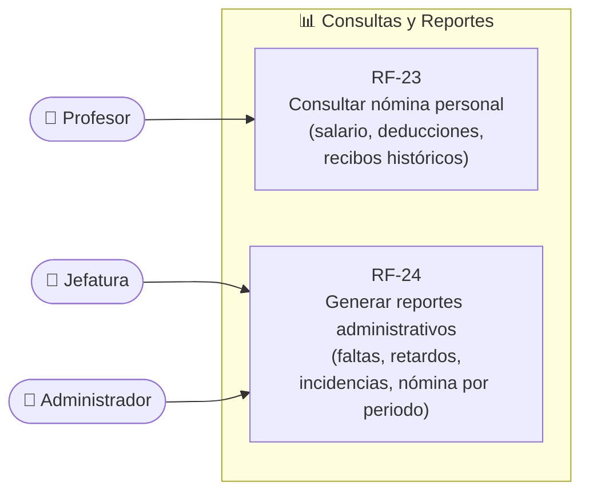

# STX-CORE-UML-CASOS-USO-v1.0
# Diagrama de Casos de Uso — Saltix

**Proyecto:** Saltix — Sistema de Control de Asistencia y Cálculo de Nómina  
**Estándar:** UML 2.x  
**Versión:** 1.0  
**Fecha:** 2026-03-18  
**Cobertura:** 24 Requerimientos Funcionales (RF-01 al RF-24)

---

## Actores del Sistema

| Actor | Descripción |
|-------|-------------|
| **Administrador** | Gestiona usuarios, roles, planteles, departamentos y configuración general del sistema |
| **Jefatura** | Jefe de departamento. Aprueba o rechaza incidencias, correcciones, transferencias y capturas manuales |
| **Profesor** | Docente registrado en el sistema. Registra asistencia, consulta su nómina y solicita correcciones |
| **Contador** | Responsable del módulo de nómina: configura periodos, genera cálculos y emite recibos |
| **Sistema** | Actor interno que ejecuta procesos automáticos (cálculo de nómina, notificaciones, validaciones) |

---

## Diagrama General del Sistema

```mermaid
flowchart LR
    %% ── Actores ──────────────────────────────────────────
    Admin(["👤 Administrador"])
    Jefe(["👤 Jefatura"])
    Prof(["👤 Profesor"])
    Cont(["👤 Contador"])
    Sys(["⚙️ Sistema"])

    %% ══════════════════════════════════════════════════════
    subgraph SYS["🖥️ SALTIX — Sistema de Control de Asistencia y Cálculo de Nómina"]

        %% ── Módulo: Gestión de Personal ──────────────────
        subgraph MOD1["📋 Gestión de Personal"]
            UC01["RF-01\nRegistrar empleado"]
            UC11["RF-11\nGestionar departamentos"]
            UC12["RF-12\nControlar relación jerárquica"]
            UC13["RF-13\nTransferir profesor"]
            UC14["RF-14\nGestionar planteles"]
            UC15["RF-15\nCambiar estado del profesor"]
            UC16["RF-16\nReactivar profesor"]
        end

        %% ── Módulo: Asistencias ──────────────────────────
        subgraph MOD2["🕐 Asistencias"]
            UC02["RF-02\nRegistrar asistencia"]
            UC03["RF-03\nJustificar incidencia"]
            UC08["RF-08\nAdjuntar evidencia documental"]
            UC20["RF-20\nSolicitar corrección de asistencia"]
            UC21["RF-21\nRegistro manual autorizado"]
            UC22["RF-22\nFlujo de aprobación"]
        end

        %% ── Módulo: Nómina ───────────────────────────────
        subgraph MOD3["💰 Nómina y Contabilidad"]
            UC04["RF-04\nCalcular nómina"]
            UC05["RF-05\nConfigurar catálogo de percepciones"]
            UC06["RF-06\nClasificar percepciones fiscalmente"]
            UC07["RF-07\nAplicar secuencia de cálculo"]
            UC09["RF-09\nPagar por hora clase válida"]
            UC10["RF-10\nGenerar recibo legal de nómina"]
            UC17["RF-17\nConfigurar periodo de nómina"]
            UC18["RF-18\nControlar periodo abierto"]
            UC19["RF-19\nVista previa de nómina"]
        end

        %% ── Módulo: Consultas y Reportes ─────────────────
        subgraph MOD4["📊 Consultas y Reportes"]
            UC23["RF-23\nConsultar nómina e historial"]
            UC24["RF-24\nGenerar reportes administrativos"]
        end

    end

    %% ══════════════════════════════════════════════════════
    %% Relaciones: Administrador
    Admin --> UC01
    Admin --> UC11
    Admin --> UC12
    Admin --> UC14
    Admin --> UC15
    Admin --> UC16
    Admin --> UC24

    %% Relaciones: Jefatura
    Jefe --> UC03
    Jefe --> UC13
    Jefe --> UC21
    Jefe --> UC22
    Jefe --> UC24

    %% Relaciones: Profesor
    Prof --> UC02
    Prof --> UC08
    Prof --> UC20
    Prof --> UC23

    %% Relaciones: Contador
    Cont --> UC05
    Cont --> UC06
    Cont --> UC17
    Cont --> UC18
    Cont --> UC19
    Cont --> UC10

    %% Relaciones: Sistema (automático)
    Sys --> UC04
    Sys --> UC07
    Sys --> UC09
```

---

## Diagrama por Módulo

### Módulo 1 — Gestión de Personal

---

### Módulo 2 — Asistencias

---

### Módulo 3 — Nómina y Contabilidad

---

### Módulo 4 — Consultas y Reportes

---

## Tabla de Trazabilidad RF → Actor → Caso de Uso

| RF | Nombre | Actor(es) | Módulo |
|----|--------|-----------|--------|
| RF-01 | Registro de Empleados | Administrador | Gestión de Personal |
| RF-02 | Captura de Asistencia | Profesor, Sistema | Asistencias |
| RF-03 | Justificación de Incidencias | Jefatura | Asistencias |
| RF-04 | Motor de Cálculo de Nómina | Sistema | Nómina |
| RF-05 | Catálogo Configurable de Percepciones | Contador | Nómina |
| RF-06 | Clasificación Fiscal de Percepciones | Contador | Nómina |
| RF-07 | Secuencia Obligatoria de Cálculo | Sistema | Nómina |
| RF-08 | Evidencia Documental de Incidencias | Profesor | Asistencias |
| RF-09 | Unidad de Pago por Hora Clase | Sistema | Nómina |
| RF-10 | Recibo Legal de Nómina | Contador | Nómina |
| RF-11 | Entidad Departamento | Administrador | Gestión de Personal |
| RF-12 | Relación Jerárquica | Administrador, Sistema | Gestión de Personal |
| RF-13 | Transferencia de Profesores | Jefatura | Gestión de Personal |
| RF-14 | Manejo de Planteles | Administrador | Gestión de Personal |
| RF-15 | Estados del Profesor | Administrador | Gestión de Personal |
| RF-16 | Reactivación | Administrador | Gestión de Personal |
| RF-17 | Configuración de Periodo | Contador | Nómina |
| RF-18 | Control de Periodo Abierto | Contador, Sistema | Nómina |
| RF-19 | Vista Previa de Nómina | Contador | Nómina |
| RF-20 | Solicitud de Corrección | Profesor | Asistencias |
| RF-21 | Registro Manual Autorizado | Jefatura | Asistencias |
| RF-22 | Flujo de Aprobación | Jefatura, Sistema | Asistencias |
| RF-23 | Consulta del Profesor | Profesor | Consultas |
| RF-24 | Reportes Administrativos | Administrador, Jefatura | Consultas |