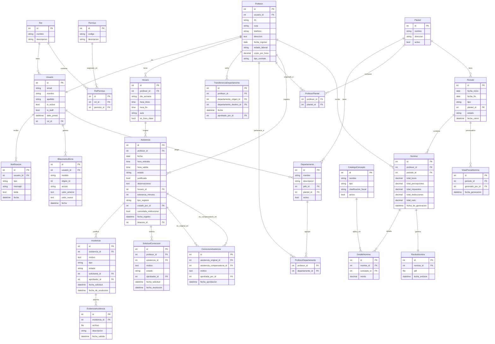

# STX-DB-DER-MODELO-v1.0
# Diagrama Entidad-Relación — Saltix

**Proyecto:** Saltix  
**Versión:** 1.0  
**Fecha:** 2026-03-13  

---

```mermaid
erDiagram

    %% ── CORE ──────────────────────────────────────────
    Plantel {
        int id PK
        string nombre
        string direccion
        bool activo
    }

    BitacoraAuditoria {
        int id PK
        int usuario_id FK
        string modelo
        int objeto_id
        string accion
        text valor_anterior
        text valor_nuevo
        datetime fecha
    }

    Notificacion {
        int id PK
        int usuario_id FK
        string tipo
        string mensaje
        bool leida
        datetime fecha
    }

    %% ── USERS ─────────────────────────────────────────
    Usuario {
        int id PK
        string email
        string nombre
        string apellido
        bool is_active
        bool is_staff
        datetime date_joined
        int rol_id FK
    }

    Rol {
        int id PK
        string nombre
        string descripcion
    }

    Permiso {
        int id PK
        string codigo
        string descripcion
    }

    RolPermiso {
        int id PK
        int rol_id FK
        int permiso_id FK
    }

    Departamento {
        int id PK
        string nombre
        string descripcion
        int jefe_id FK
        int plantel_id FK
        bool activo
    }

    %% ── PROFESORES ────────────────────────────────────
    Profesor {
        int id PK
        int usuario_id FK
        string rfc
        string curp
        string telefono
        text direccion
        date fecha_ingreso
        string estado_laboral
        decimal costo_por_hora
        string tipo_contrato
    }

    Horario {
        int id PK
        int profesor_id FK
        string dia_semana
        time hora_inicio
        time hora_fin
        string aula
        bool es_hora_clase
    }

    TransferenciaDepartamento {
        int id PK
        int profesor_id FK
        int departamento_origen_id FK
        int departamento_destino_id FK
        datetime fecha
        int aprobado_por_id FK
    }

    %% Relación N:M Profesor-Departamento
    ProfesorDepartamento {
        int profesor_id FK
        int departamento_id FK
    }

    %% Relación N:M Profesor-Plantel
    ProfesorPlantel {
        int profesor_id FK
        int plantel_id FK
    }

    %% ── ASISTENCIAS ───────────────────────────────────
    Asistencia {
        int id PK
        int profesor_id FK
        date fecha
        time hora_entrada
        time hora_salida
        string estado
        bool justificada
        text observaciones
        int horario_id FK
        int tolerancia_minutos
        string tipo_registro
        int creado_por_id FK
        bool cancelada_institucional
        datetime fecha_registro
        int bitacora_id FK
    }

    Incidencia {
        int id PK
        int asistencia_id FK
        text motivo
        string tipo
        string estado
        int solicitante_id FK
        int aprobador_id FK
        datetime fecha_solicitud
        datetime fecha_de_resolucion
    }

    EvidenciaIncidencia {
        int id PK
        int incidencia_id FK
        file archivo
        string descripcion
        datetime fecha_subida
    }

    SolicitudCorreccion {
        int id PK
        int profesor_id FK
        int asistencia_id FK
        text motivo
        string estado
        int aprobador_id FK
        datetime fecha_solicitud
        datetime fecha_resolucion
    }

    CorreccionAsistencia {
        int id PK
        int asistencia_original_id FK
        int asistencia_compensatoria_id FK
        text motivo
        int aprobada_por_id FK
        datetime fecha_aprobacion
    }

    %% ── CONTABILIDAD ──────────────────────────────────
    Periodo {
        int id PK
        date fecha_inicio
        date fecha_fin
        string tipo
        int plantel_id FK
        string estado
        datetime fecha_cierre
    }

    Nomina {
        int id PK
        int profesor_id FK
        int periodo_id FK
        decimal total_bruto
        decimal total_percepciones
        decimal total_impuestos
        decimal total_deducciones
        decimal total_neto
        datetime fecha_de_generacion
    }

    CatalogoConcepto {
        int id PK
        string nombre
        string tipo
        string clasificacion_fiscal
        bool activo
    }

    DetalleNomina {
        int id PK
        int nomina_id FK
        int concepto_id FK
        decimal monto
    }

    ReciboNomina {
        int id PK
        int nomina_id FK
        file pdf
        datetime fecha_emision
    }

    VistaPreviaNomina {
        int id PK
        int periodo_id FK
        int generado_por_id FK
        datetime fecha_generacion
    }

    %% ── RELACIONES ────────────────────────────────────
    Usuario ||--o{ Notificacion : "recibe"
    Usuario ||--o{ BitacoraAuditoria : "genera"
    Rol ||--o{ Usuario : "tiene"
    Rol ||--o{ RolPermiso : "contiene"
    Permiso ||--o{ RolPermiso : "asignado_en"
    Plantel ||--o{ Departamento : "tiene"
    Usuario ||--o{ Departamento : "dirige"

    Profesor ||--|| Usuario : "es"
    Profesor ||--o{ Horario : "tiene"
    Profesor ||--o{ TransferenciaDepartamento : "sufre"
    Profesor ||--o{ ProfesorDepartamento : "pertenece_a"
    Departamento ||--o{ ProfesorDepartamento : "agrupa"
    Profesor ||--o{ ProfesorPlantel : "asignado_a"
    Plantel ||--o{ ProfesorPlantel : "contiene"

    Profesor ||--o{ Asistencia : "registra"
    Horario ||--o{ Asistencia : "origina"
    Asistencia ||--o{ Incidencia : "justifica"
    Incidencia ||--o{ EvidenciaIncidencia : "adjunta"
    Asistencia ||--o{ SolicitudCorreccion : "solicita"
    Asistencia ||--o{ CorreccionAsistencia : "es_original_en"
    Asistencia ||--o{ CorreccionAsistencia : "es_compensatoria_en"

    Plantel ||--o{ Periodo : "tiene"
    Periodo ||--o{ Nomina : "contiene"
    Profesor ||--o{ Nomina : "recibe"
    Nomina ||--o{ DetalleNomina : "detalla"
    CatalogoConcepto ||--o{ DetalleNomina : "aplica_en"
    Nomina ||--|| ReciboNomina : "genera"
    Periodo ||--o{ VistaPreviaNomina : "previsualiza"
```